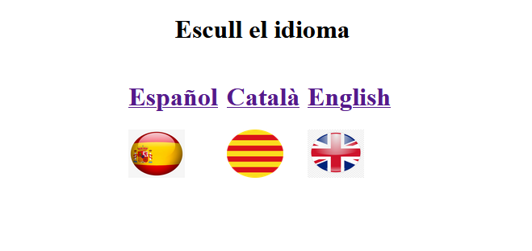

# Practica 5: Login amb cookies
## ACTIVITAT

Seguint la pràctica anterior del login funcional, ara se li ha d’afegir la opció d’escollir idioma (català / español / anglès)

Cal crear una view anterior al login per escollir l’idioma. Un cop escollit l’idioma, les següents pàgines s’hauran de mostrar en l’idioma seleccionat.

En cada view ha de tenir:
- L’opció d’eliminar cookie redirigint a la view d’escollir idioma.
- Un enllaç que vagi a la selecció d’idioma (el qual no es redirigirà si la cookie no està eliminada).

Cal crear 3 arxius en php:
- un arxiu de creació de cookie, un arxiu de redirecció de view segons l’idioma de la cookie i un arxiu d’eliminació de cookie

Per tant, tot el circuit de la pràctica anterior (login i formulari) caldrà fer-lo igual, però mostrant el login, formulari i les dades d’alumnat / professorat segons l’idioma escollit previament.

En el video no caldrà mostrar la inserció de dades a la BBDD, sino el funcionament de les cookies en totes les views del repositori.

### Pàgina de selecció d'idiomes.

[Video Joana](https://drive.google.com/file/d/1ARIiqhveyJc2mjyEYMUEM0Ky6wTmNeE4/view?usp=drive_link)

[Video Oriana](https://drive.google.com/file/d/1AZ6JaY99_ba_WWdZEzQBdrqW38s7G5Ea/view?usp=sharing)